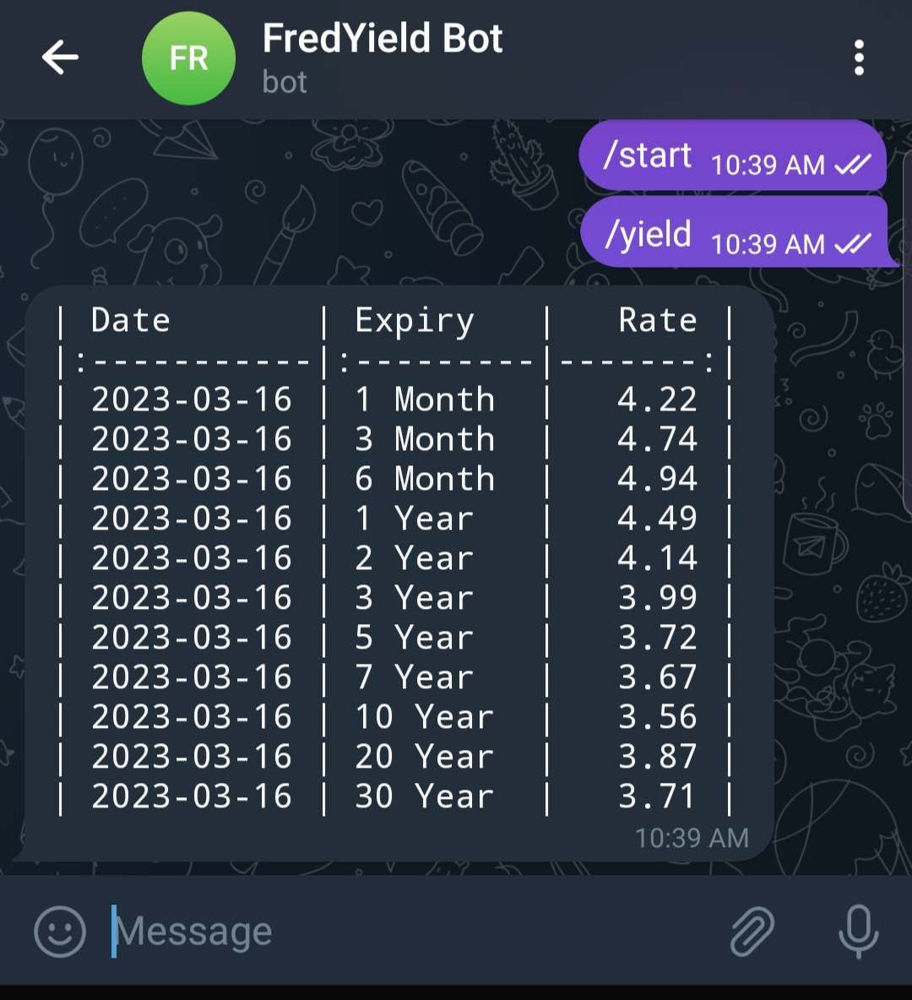
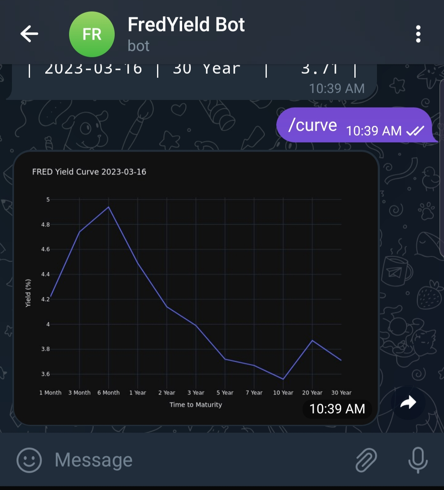

# YieldTelegramBot
Retrieve yield data from FRED through a Telegram bot.

## Usage
This is a simple Telegram bot that responds to the following commands:
- yield  - this returns a table of the most recent yield rates
- curve  - shows the yield curve on the most recent rates

Example response for the table:

Example response for the yield curve:

## Setup

To set this up, you will need a telegram bot key and a Fred API key (https://fred.stlouisfed.org/docs/api/fred/).  Add these to the .env file.  

On windows, create a virtual environment and install the packages:

`
pip install -r requirement.txt
`

On linux, the requirements file is different due to the library dependency for saving files:

`
pip install -r requirements-linux.txt
`

Start the application on the command line with

`
python main.py
`

Once started, the application polls the Telegram service for messages and response appropriately.

Alternatively, a docker image has been provided to run within a linux environment.
